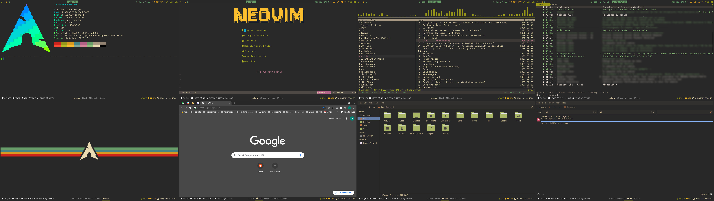

# Dotfiles

My personal dotfiles, managed with GNU stow and used in Archlinux

# To install

I have concocted 2 scripts to ease the installation of arch, to help me reinstall if I ever need to, with _my_ personal preferences

A (Non comprehensive) list of them are:

- EFI
- ucode
- systemd-boot (option to install grub)
- btrfs (option to format as ext4)
- systemd-networkd
- reflector (with weekly timer)
- iwd (if wireless)
- pipewire
- doas (instead of sudo)
- sway (option for i3)
- neovim

To install just boot into a clean arch iso, install git and
	
	git clone https://github.com/mxdevmanuel/dotfiles.git && cd dotfiles/installation ; zsh archbase.zsh

and follow the prompts and then after chroot 

	cd ~/dotfiles/installation ; zsh archroot.zsh

up to these point you will have a running arch install with everything I need, an extra step which is stil WIP could be

	su <username>

	cd ~/.dotfiles/installation/ ; zsh archuser.zsh

this will ATM help you setup git, disperse the dotfiles you want to use, create a virtualenv for certain commands to run on and setup neovim, however I have'nt used this script yet during and installation as it is still pretty early progress and I would suggest to doit manually for the time being.

### Notes and comments

The _archroot.zsh_ installation script will append `~/.local/bin` to  your PATH 

Rather than an installer this is a helper to avoid all the repetitive commands that have to be run and boilerplating that has to be done for LANG, hosts, useradd, etc. and to avoid forgetting any important step.

I know of archinstall and maybe someday I'll redo my script with it's library but doing it this way was more fun.

# Fonts and theme

To download fonts run the following command and stow _local_
        
	git submodule init

To download and set the gtk theme

	zsh .gtk/install.zsh

# Recommendations

#### Git

Run this command to use my git hooks

	git config --local core.hooksPath git/githooks

#### Backups

Btrfs is my preferred filesystem for _/_ , _/home_ and _/shared_ because of the snapshot capabilities and it's capabilities for SSD. As I have a way to easilly and quickly reinstall my base system I only backup my _/home_ to _/shared_ daily when system is idle.

_/shared_ is usually an HDD to store big files, share with other SO if I'm dual booting and to store backups.

If you wanna use this modify `system/backup/btrfs-backup.sh` and change `$BCKPFOLDER` to your backup directory, copy the same file to _/usr/bin_, copy `system/backup/btrfs-backup.service` and `system/backup/btrfs-backup.timer` to _/etc/systemd/system_ and then run:

	# systemctl enable --now btrfs-backup.timer

#### Keyboard

I usually use 60% programmable mechanical keyboards as my daily drivers, so I'm used to key combinations and layers, but this is not always possible, specially when on the go with a laptop, so I use [**keyd**](https://github.com/rvaiya/keyd) to address this, I found it to be a simple yet powerful tool to be able to change how a non-programmable keybord works under linux. My config is located in `system/keyd/AT Translated Set 2 keyboard.cfg` but the name of your keyboard may vary. I set the following changes to my keyboard:

- CAPS on hold is CTRL and on tap is ESC
- L_Alt key maps to L_Super
- L_Super key maps to L_ALT
- R_Alt on hold is _vim layer_ and on tap it maps to Menu (because thinkpad)
- _vim layer_ maps the hjkl to the arrow keys, so h -> Left, j -> Down, k -> Up and l -> Right

After installing keyd (manually compiled or from the AUR) and copying the config file to the proper directory just enable keyd.service

	# systemctl enable --now keyd.service

# Packages

## AUR and non-repo software
- nq
- wob
- cava
- mpv-mpris
- kmscon-patched-git, libtsm-patched-git
- keyd
- xxd-standalone
- ripmime
