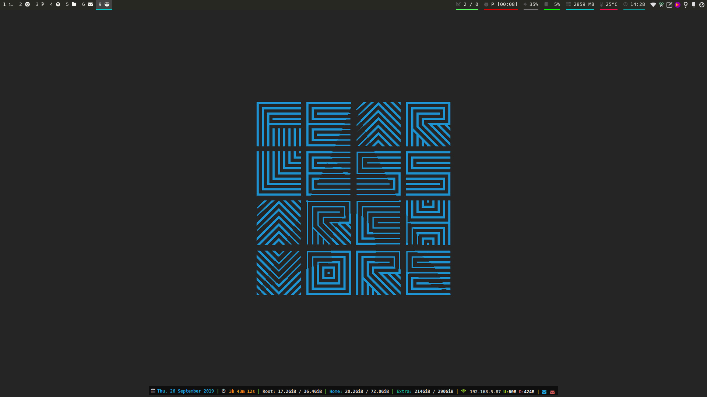
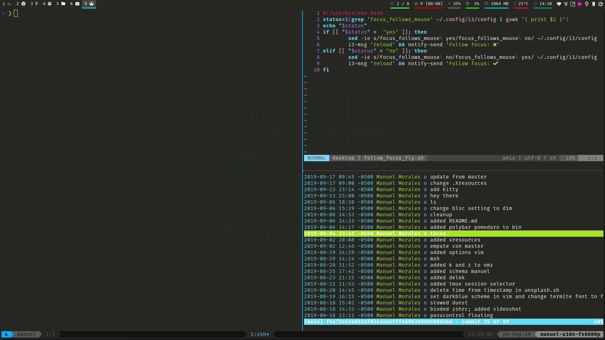

# Manuel's dotfiles 

## __Desktop version__

## Programs:
- i3-gaps
- termite
- tmux
- vim
- rofi
- polybar
- conky
- vifm
- cmus
- ncspot
- vlc
- neomutt
- newsboat
- tig
- vimb
- sxiv
- zathura
- blezz
- dunst
- betterlockscreen
- udiskie, lightshot, copyq and redshift (in the systray)

### Colors:

#### Monokai inspired
[Base16 Monokai](https://github.com/chriskempson/base16-xresources/blob/master/xresources/base16-monokai-256.Xresources
)

### Screenshots

### TODO:
- migrate todo script to a text file to sync over laptop-desktop-work
